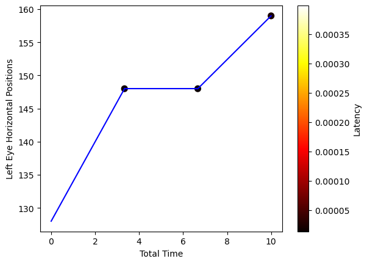
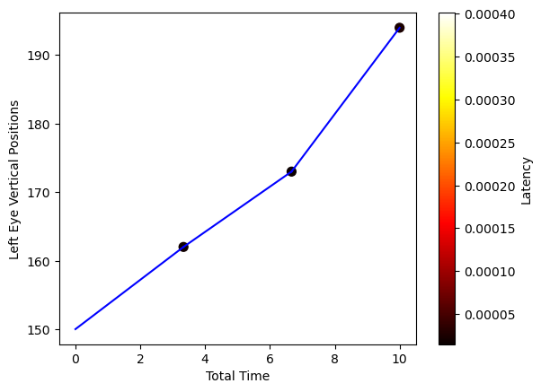
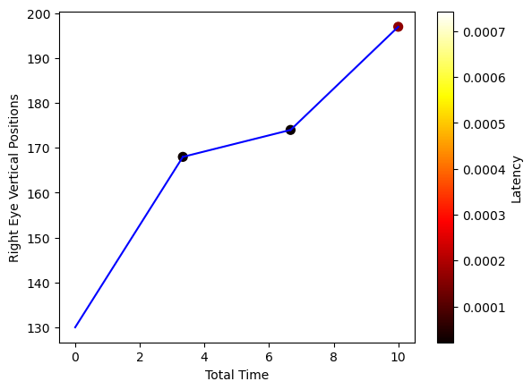
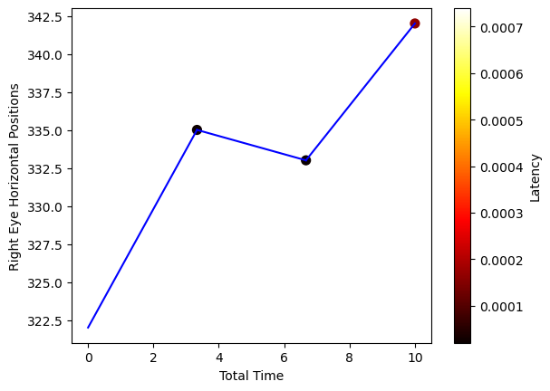

```python
import time
import cv2
import mediapipe as mp
import timeit
import pyautogui
import numpy as np
import matplotlib.pyplot as plt
import csv
import seaborn as sns
from PIL import ImageGrab

total_time_final = 0
header = [
      "Timestamp", "Latency Values Left X", "Latency Values Left Y", "Latency Values Right X", "Latency Values Right Y", 
    "All positions left horizontal", "All positions left vertical", "All positions right horizontal", "All positions right vertical", 
    "Position change left horizontal", "Position Change left vertical", "Position Change right horizontal", "Position change right vertical", 
    "Left linger", "Right Linger"
]
with open('eyetracking.csv', 'w', newline='') as file:
    csv_writer = csv.writer(file)
    csv_writer.writerow(header)
    
cap = cv2.VideoCapture(0)
latency_vals_left_x = []
latency_vals_left_y = []
latency_vals_right_x = []
latency_vals_right_y = []

all_positions_left_horizontal = []
all_positions_left_vertical = []
all_positions_right_horizontal = []
all_positions_right_vertical = []

position_change_horizontal_left = 0
position_change_vertical_left = 0
position_change_horizontal_right = 0
position_change_vertical_right = 0

change_positions = []
movement_threshold = 30  # Define a threshold for significant movement
start_left_x, start_left_y = 0, 0
start_right_x, start_right_y = 0, 0

capture_interval = 5
last_capture_time = time.time()

# Additional lists to store gaze linger times
linger_times_left = []
linger_times_right = []

# Function to detect iris locations and segregate left and right eye
def get_irises_location(frame_gray):
    eye_cascade = cv2.CascadeClassifier(cv2.data.haarcascades + 'haarcascade_eye.xml')
    eyes = eye_cascade.detectMultiScale(frame_gray, 1.3, 10)  # Detect eyes
    irises = []

    for (ex, ey, ew, eh) in eyes:
        iris_x = int(ex + float(ew / 2))  # Iris center X
        iris_y = int(ey + float(eh / 2))  # Iris center Y
        irises.append([np.float32(iris_x), np.float32(iris_y)])

    # Sort based on X-coordinate to segregate left and right eyes
    if len(irises) >= 2:
        irises = sorted(irises, key=lambda x: x[0])  # Sort by X (horizontal position)
        left_eye = irises[0]  # First is left eye
        right_eye = irises[1]  # Second is right eye
        return np.array(left_eye), np.array(right_eye)
    return None, None  # If less than 2 eyes detected


def update_linger_times(linger_times, all_positions_horizontal, all_positions_vertical, iris_x, iris_y, capture_interval):
    if linger_times and all_positions_horizontal[-2] == iris_x and all_positions_vertical[-2] == iris_y:
        linger_times[-1] += capture_interval
    else:
        linger_times.append(capture_interval)

# Initialize Haar cascades for face and eye detection
face_cascade = cv2.CascadeClassifier(cv2.data.haarcascades + 'haarcascade_frontalface_default.xml')

# Initialize video capture from webcam
cap = cv2.VideoCapture(0)
start = time.time()

while True:
    # Capture each frame from webcam
    ret, frame = cap.read()
    if not ret:
        break

    gray = cv2.cvtColor(frame, cv2.COLOR_BGR2GRAY)
    gray = cv2.equalizeHist(gray)  # Histogram equalization for better detection

    # Detect faces in the frame
    faces = face_cascade.detectMultiScale(gray, 1.3, 5)
    for (x, y, w, h) in faces:
        roi_gray = gray[y:y+h, x:x+w]
        roi_color = frame[y:y+h, x:x+w]

        # Get irises location and segregate left and right eye
        left_eye, right_eye = get_irises_location(roi_gray)

        # Initialize timing
        start_time = timeit.default_timer()
        start_time_all_left_x = timeit.default_timer()
        start_time_all_left_y = start_time_all_left_x
        start_time_all_right_x = start_time_all_left_x
        start_time_all_right_y = start_time_all_left_x

        if left_eye is not None and right_eye is not None:
            # Unpack left and right eye positions
            iris_left_x, iris_left_y = left_eye
            iris_right_x, iris_right_y = right_eye

            # Process the left eye
            all_positions_left_horizontal.append(iris_left_x)
            all_positions_left_vertical.append(iris_left_y)
            cv2.circle(roi_color, (int(iris_left_x), int(iris_left_y)), 2, (0, 255, 255), -1)

            # Update latency for left eye horizontal movement
            if abs(iris_left_x - start_left_x) > 5:
                end_time_all_left_x = timeit.default_timer()
                latency_left_x = end_time_all_left_x - start_time_all_left_x
                latency_vals_left_x.append(latency_left_x)
                start_time_all_left_x = end_time_all_left_x  # Update start time for left x

            # Update latency for left eye vertical movement
            if abs(iris_left_y - start_left_y) > 5:
                end_time_all_left_y = timeit.default_timer()
                latency_left_y = end_time_all_left_y - start_time_all_left_y
                latency_vals_left_y.append(latency_left_y)
                start_time_all_left_y = end_time_all_left_y  # Update start time for left y

            # Check for significant horizontal movement in the left eye
            if abs(iris_left_x - start_left_x) > movement_threshold:
                end_time = timeit.default_timer()
                latency_horizontal_left = end_time - start_time
                position_change_horizontal_left = iris_left_x - start_left_x

                change_positions.append(position_change_horizontal_left)
                print("Left eye - Horizontal direction changed by:", position_change_horizontal_left, latency_horizontal_left)

                start_left_x = iris_left_x
                start_time = end_time

            # Check for significant vertical movement in the left eye
            if abs(iris_left_y - start_left_y) > movement_threshold:
                end_time = timeit.default_timer()
                latency_vertical_left = end_time - start_time
                position_change_vertical_left = iris_left_y - start_left_y

                change_positions.append(position_change_vertical_left)
                print("Left eye - Vertical direction changed by:", position_change_vertical_left, latency_vertical_left)

                start_left_y = iris_left_y
                start_time = end_time
  
               # Update linger times for left eye position
            update_linger_times(linger_times_left, all_positions_left_horizontal, all_positions_left_vertical, iris_left_x, iris_left_y, capture_interval)
            
            # Process the right eye
            all_positions_right_horizontal.append(iris_right_x)
            all_positions_right_vertical.append(iris_right_y)
            cv2.circle(roi_color, (int(iris_right_x), int(iris_right_y)), 2, (255, 0, 255), -1)
       
            # Update latency for right eye horizontal movement
            if abs(iris_right_x - start_right_x) > 5:
                end_time_all_right_x = timeit.default_timer()
                latency_right_x = end_time_all_right_x - start_time_all_right_x
                latency_vals_right_x.append(latency_right_x)
                start_time_all_right_x = end_time_all_right_x  # Update start time for right x

            # Update latency for right eye vertical movement
            if abs(iris_right_y - start_right_y) > 5:
                end_time_all_right_y = timeit.default_timer()
                latency_right_y = end_time_all_right_y - start_time_all_right_y
                latency_vals_right_y.append(latency_right_y)
                start_time_all_right_y = end_time_all_right_y  # Update start time for right y

            # Check for significant horizontal movement in the right eye
            if abs(iris_right_x - start_right_x) > movement_threshold:
                end_time = timeit.default_timer()
                latency_horizontal_right = end_time - start_time
                position_change_horizontal_right = iris_right_x - start_right_x

                change_positions.append(position_change_horizontal_right)
                print("Right eye - Horizontal direction changed by:", position_change_horizontal_right)

                start_right_x = iris_right_x
                start_time = end_time

            # Check for significant vertical movement in the right eye
            if abs(iris_right_y - start_right_y) > movement_threshold:
                end_time = timeit.default_timer()
                latency_vertical_right = end_time - start_time
                position_change_vertical_right = iris_right_y - start_right_y

                change_positions.append(position_change_vertical_right)
                print("Right eye - Vertical direction changed by:", position_change_vertical_right, latency_vertical_right)

                start_right_y = iris_right_y
                start_time = end_time
   
            # Update linger times for right eye position
            update_linger_times(linger_times_right, all_positions_right_horizontal, all_positions_right_vertical, iris_right_x, iris_right_y, capture_interval)

            # Capture screen at the set interval
            if time.time() - last_capture_time >= capture_interval:
                # Reset capture timer
                last_capture_time = time.time()
        
                # Generate unique timestamp for filenames
                timestamp = int(time.time())
        
                # Capture screenshot
                screenshot = ImageGrab.grab()
                screenshot.save(f"screenshot_{timestamp}.png")
                width, height = screenshot.size
                my_dpi = 118
        
                # Map linger times to opacity values
                left_opacities = [min(linger / 10, 1.0) for linger in linger_times_left]
                right_opacities = [min(linger / 10, 1.0) for linger in linger_times_right]
        
                # Scatter plot for left eye
                plt.figure(figsize=(width / my_dpi, height / my_dpi))
                plt.scatter(all_positions_left_horizontal, all_positions_left_vertical, 
                            color='red', label='Left Eye', s=500, alpha=left_opacities)
                plt.axis('off')
                plt.tight_layout(pad=1)
                plt.savefig(f'left_eye_scatter_{timestamp}.png', dpi=my_dpi * 2)
                plt.close()
        
                # Scatter plot for right eye
                plt.figure(figsize=(width / my_dpi, height / my_dpi))
                plt.scatter(all_positions_right_horizontal, all_positions_right_vertical, 
                            color='red', label='Right Eye', s=500, alpha=right_opacities)
                plt.axis('off')
                plt.tight_layout(pad=1)
                plt.savefig(f'right_eye_scatter_{timestamp}.png', dpi=my_dpi * 2)
                plt.close()
        
                # Load the screenshots
                img1 = cv2.imread(f'screenshot_{timestamp}.png')
                left_eye_img = cv2.imread(f'left_eye_scatter_{timestamp}.png')
                right_eye_img = cv2.imread(f'right_eye_scatter_{timestamp}.png')
        
                # Resize scatter plots if necessary
                if img1.shape != left_eye_img.shape:
                    left_eye_img = cv2.resize(left_eye_img, (img1.shape[1], img1.shape[0]))
                if img1.shape != right_eye_img.shape:
                    right_eye_img = cv2.resize(right_eye_img, (img1.shape[1], img1.shape[0]))
        
                # Overlay scatter plots on the screenshot
                left_eye_overlay = cv2.addWeighted(img1, 0.7, left_eye_img, 0.3, 0)
                combined_overlay = cv2.addWeighted(left_eye_overlay, 0.7, right_eye_img, 0.3, 0)
        
                cv2.imwrite(f'Output_Left_Right_Eye_Scatter_{timestamp}.png', combined_overlay)

    # Display the resulting frame
    cv2.imshow('Eye Movement Tracking', frame)

    # Break the loop on 'q' key press
    if cv2.waitKey(1) & 0xFF == ord('q'):
        row = [
            time.time(), latency_vals_left_x, latency_vals_left_y, latency_vals_right_x, latency_vals_right_y,
            all_positions_left_horizontal, all_positions_left_vertical, all_positions_right_horizontal, all_positions_right_vertical,
            position_change_horizontal_left, position_change_vertical_left, position_change_horizontal_right, position_change_vertical_right,
            linger_times_left, linger_times_right
        ]
        
        with open('eyetracking.csv', 'a', newline='') as file:
            csv_writer = csv.writer(file)
            csv_writer.writerow(row)
        
        break

end = time.time()
total_time_final = end - start

# Release the capture and destroy windows
cap.release()
cv2.destroyAllWindows()

```

    Left eye - Horizontal direction changed by: 128.0 0.0004028749999633874
    Left eye - Vertical direction changed by: 150.0 0.00031816600039746845
    Right eye - Horizontal direction changed by: 322.0
    Right eye - Vertical direction changed by: 130.0 5.209000846662093e-06
    Right eye - Vertical direction changed by: 38.0 3.1041000511322636e-05
    Left eye - Horizontal direction changed by: 31.0 2.6624999918567482e-05
    Left eye - Vertical direction changed by: 44.0 0.00012470900037442334


```python
import matplotlib.pyplot as plt
import numpy as np

# Ensure total_time_final has the same length as all_positions_left_horizontal
total_time_final = np.linspace(0, 10, len(all_positions_left_horizontal))

# Trim latency_vals_left_x to match the size of all_positions_left_horizontal
min_length = min(len(all_positions_left_horizontal), len(latency_vals_left_x))
all_positions_left_horizontal = all_positions_left_horizontal[:min_length]
latency_vals_left_x = latency_vals_left_x[:min_length]
total_time_final = total_time_final[:min_length]

# Calculate the change in positions for line thickness
thickness = np.abs(np.diff(all_positions_left_horizontal, prepend=all_positions_left_horizontal[0]))

# Create a scatter plot with a color map based on latency_vals_left_x
scatter = plt.scatter(total_time_final, all_positions_left_horizontal, c=latency_vals_left_x, cmap='hot', s=50)
 
# Plot lines with varying thickness
for i in range(len(total_time_final) - 1):
    plt.plot([total_time_final[i], total_time_final[i + 1]], 
             [all_positions_left_horizontal[i], all_positions_left_horizontal[i + 1]], 
             color='blue')  # Scale line thickness based on movement

# Add a color bar to reflect the latency values
plt.colorbar(scatter, label='Latency')

# Labeling the axes
plt.xlabel('Total Time')
plt.ylabel('Left Eye Horizontal Positions')

# Display the plot
plt.show()

```


    

    


```python
import matplotlib.pyplot as plt
import numpy as np

# Ensure total_time_final has the same length as all_positions_left_vertical
total_time_final = np.linspace(0, 10, len(all_positions_left_vertical))

# Trim latency_vals_left_y to match the size of all_positions_left_vertical
min_length = min(len(all_positions_left_vertical), len(latency_vals_left_y))
all_positions_left_vertical = all_positions_left_vertical[:min_length]
latency_vals_left_y = latency_vals_left_y[:min_length]
total_time_final = total_time_final[:min_length]

# Calculate the change in positions for line thickness
thickness = np.abs(np.diff(all_positions_left_vertical, prepend=all_positions_left_vertical[0]))

# Create a scatter plot with a color map based on latency_vals_left_y
scatter = plt.scatter(total_time_final, all_positions_left_vertical, c=latency_vals_left_y, cmap='hot', s=50)

# Plot lines with varying thickness
for i in range(len(total_time_final) - 1):
    plt.plot([total_time_final[i], total_time_final[i + 1]], 
             [all_positions_left_vertical[i], all_positions_left_vertical[i + 1]], 
             color='blue')  # Scale line thickness based on movement

# Add a color bar to reflect the latency values
plt.colorbar(scatter, label='Latency')

# Labeling the axes
plt.xlabel('Total Time')
plt.ylabel('Left Eye Vertical Positions')

# Display the plot
plt.show()

```


    

    


```python
import matplotlib.pyplot as plt
import numpy as np

# Ensure total_time_final has the same length as all_positions_right_vertical
total_time_final = np.linspace(0, 10, len(all_positions_right_vertical))

# Trim latency_vals_right_y to match the size of all_positions_right_vertical
min_length = min(len(all_positions_right_vertical), len(latency_vals_right_y))
all_positions_right_vertical = all_positions_right_vertical[:min_length]
latency_vals_right_y = latency_vals_right_y[:min_length]
total_time_final = total_time_final[:min_length]

# Calculate the change in positions for line thickness
thickness = np.abs(np.diff(all_positions_right_vertical, prepend=all_positions_right_vertical[0]))

# Create a scatter plot with a color map based on latency_vals_right_y
scatter = plt.scatter(total_time_final, all_positions_right_vertical, c=latency_vals_right_y, cmap='hot', s=50)

# Plot lines with varying thickness
for i in range(len(total_time_final) - 1):
    plt.plot([total_time_final[i], total_time_final[i + 1]], 
             [all_positions_right_vertical[i], all_positions_right_vertical[i + 1]], 
             color='blue')  # Scale line thickness based on movement

# Add a color bar to reflect the latency values
plt.colorbar(scatter, label='Latency')

# Labeling the axes
plt.xlabel('Total Time')
plt.ylabel('Right Eye Vertical Positions')

# Display the plot
plt.show()

```


    

    


```python
import matplotlib.pyplot as plt
import numpy as np

# Ensure total_time_final has the same length as all_positions_right_horizontal
total_time_final = np.linspace(0, 10, len(all_positions_right_horizontal))

# Trim latency_vals_right_x to match the size of all_positions_right_horizontal
min_length = min(len(all_positions_right_horizontal), len(latency_vals_right_x))
all_positions_right_horizontal = all_positions_right_horizontal[:min_length]
latency_vals_right_x = latency_vals_right_x[:min_length]
total_time_final = total_time_final[:min_length]

# Calculate the change in positions for line thickness
thickness = np.abs(np.diff(all_positions_right_horizontal, prepend=all_positions_right_horizontal[0]))

# Create a scatter plot with a color map based on latency_vals_right_x
scatter = plt.scatter(total_time_final, all_positions_right_horizontal, c=latency_vals_right_x, cmap='hot', s=50)

# Plot lines with varying thickness
for i in range(len(total_time_final) - 1):
    plt.plot([total_time_final[i], total_time_final[i + 1]], 
             [all_positions_right_horizontal[i], all_positions_right_horizontal[i + 1]], 
             color='blue')  # Scale line thickness based on movement

# Add a color bar to reflect the latency values
plt.colorbar(scatter, label='Latency')

# Labeling the axes
plt.xlabel('Total Time')
plt.ylabel('Right Eye Horizontal Positions')

# Display the plot
plt.show()

```


    

    


```python

```


```python

```
